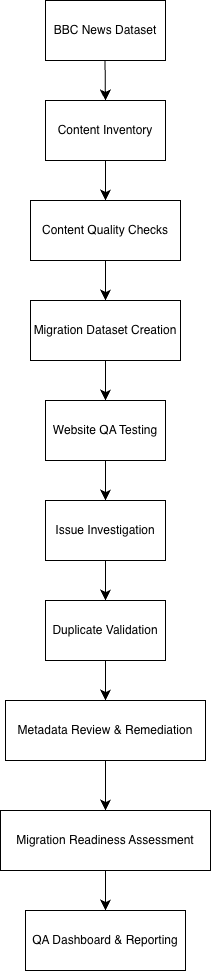
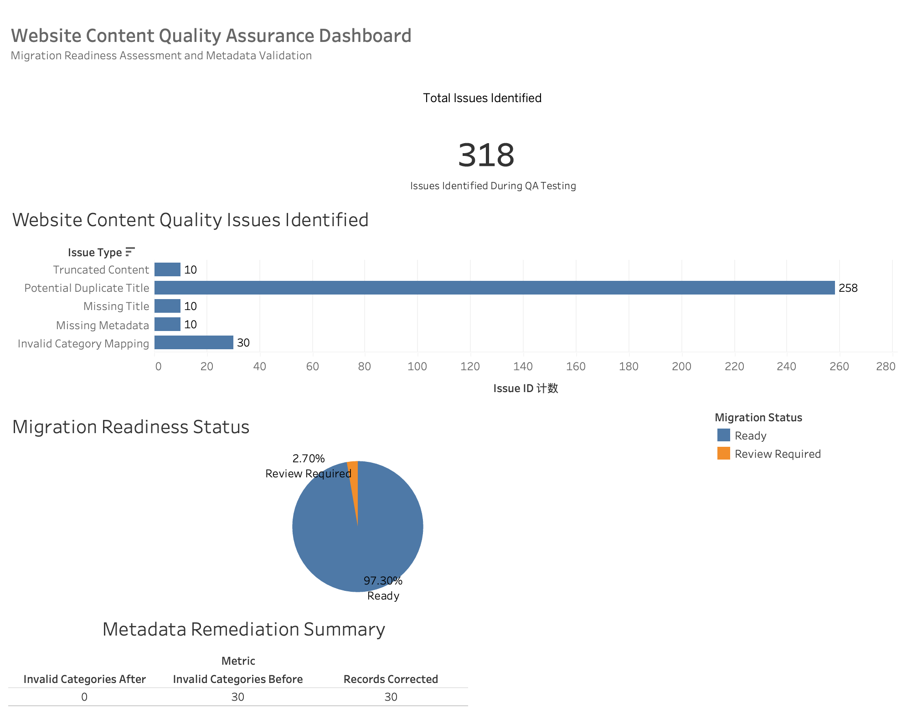

# Website Content Quality Assurance Project

## Overview

This project simulates a website content migration and quality assurance workflow using a BBC News dataset containing 2,225 content records.

The objective was to replicate common activities performed during website redevelopment and content migration projects, including content review, metadata validation, quality assurance testing, issue investigation, remediation, migration readiness assessment, and reporting.

The project was designed to reflect the responsibilities commonly performed by Website Support Analysts, Content Administrators, and Digital Project Support teams.

---

## Project Objectives

- Review and validate website content prior to migration
- Identify content quality and metadata issues
- Investigate duplicate and incomplete records
- Standardise metadata values
- Assess migration readiness
- Produce quality assurance reporting and documentation

---

## Tools Used

| Tool | Purpose |
|--------|--------|
| Python | Data processing and QA automation |
| Pandas | Data validation and issue detection |
| Tableau | Dashboard reporting and visualisation |
| Draw.io | Workflow documentation |

---

## Dataset

**Source:** BBC News Dataset

**Records:** 2,225 articles

**Fields:**

- Category
- Filename
- Title
- Content

---

## Project Workflow



The project followed a structured QA workflow:

1. Content Inventory
2. Content Quality Checks
3. Migration Dataset Creation
4. Website QA Testing
5. Issue Investigation
6. Duplicate Validation
7. Metadata Review & Remediation
8. Migration Readiness Assessment
9. QA Dashboard & Reporting

---

## Quality Assurance Activities

### Content Inventory

Reviewed all content records and validated dataset structure.

Checks included:

- Record counts
- Dataset structure validation
- Missing value assessment

---

### Content Quality Checks

Performed initial content reviews to identify:

- Missing titles
- Missing metadata
- Missing categories
- Duplicate titles

---

### Simulated Website Migration

Created a migration-ready dataset to simulate content preparation activities commonly performed during website redevelopment projects.

---

### Website QA Testing

Introduced and identified common migration issues:

- Missing Title
- Missing Metadata
- Invalid Category Mapping
- Truncated Content
- Potential Duplicate Titles

---

### Issue Investigation

Generated issue logs and reviewed affected records requiring remediation or manual review.

---

### Duplicate Content Validation

Validated duplicate title records to distinguish:

- Potential duplicate titles
- True duplicate content
- Metadata conflicts

#### Results

| Metric | Count |
|----------|----------:|
| Potential Duplicate Titles | 60 |
| True Duplicate Content Records | 196 |
| Metadata Conflict Records | 2 |

---

### Metadata Review & Remediation

Reviewed inconsistent category values and applied metadata standardisation rules.

Examples:

- BUSINESS → business
- Business → business
- biz → business

#### Results

| Metric | Value |
|----------|----------:|
| Invalid Categories Before | 30 |
| Invalid Categories After | 0 |
| Records Corrected | 30 |

---

### Migration Readiness Assessment

Assessed content readiness for migration into a new website environment.

#### Results

| Status | Records |
|----------|----------:|
| Ready | 2,165 |
| Review Required | 60 |

---

## Dashboard



The Tableau dashboard summarises:

- Total issues identified
- Content quality issue breakdown
- Migration readiness status
- Metadata remediation outcomes

---

## Key Outcomes

- Reviewed 2,225 content records
- Identified 318 content quality issues
- Investigated duplicate content risks
- Validated metadata consistency
- Standardised category mappings
- Produced migration readiness reporting
- Developed Tableau QA dashboard
- Created workflow documentation and issue logs

---

## Repository Structure

```text
Digital_Content_Migration_QA_Project
│
├── README.md
├── data
├── scripts
├── outputs
├── screenshots
└── documentation
```

---

## Skills Demonstrated

- Content Review
- Website QA Testing
- Metadata Validation
- Content Migration Support
- Issue Investigation
- Data Quality Assessment
- Documentation
- Reporting & Visualisation
- Python (Pandas)
- Tableau
